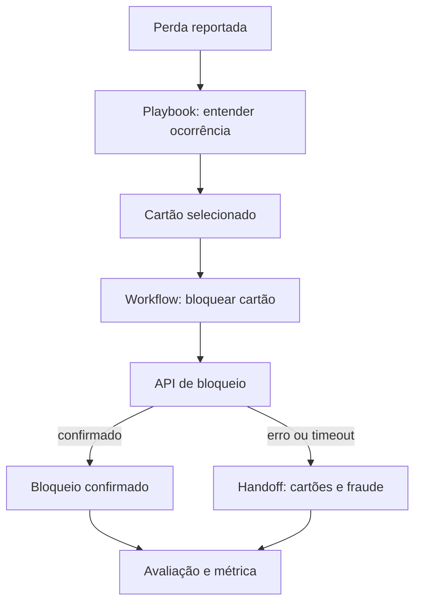

# Agent Interaction Blueprint

Um modelo versionável para desenhar, especificar e avaliar interações de chatbots e agentes de IA em atendimento ao cliente.

Ele usa Markdown, frontmatter YAML e wikilinks do Obsidian para conectar objetivos, fluxos determinísticos, eventos, ferramentas, conhecimento, variáveis, riscos, handoff, testes, avaliações e métricas.

## Comece aqui

- Leia o [modelo de relações](docs/relationship-model.md) e o [schema](docs/schema.md).
- Copie os arquivos de [templates](templates/) para criar uma nova jornada.
- Explore o [exemplo de cartão perdido](examples/cartao-perdido/).
- Consulte os [campos do blueprint](docs/agent-interaction-blueprint-campos.md).

## Cadeia de referência



## Estrutura

```text
docs/                 Convenções, schema e documento-base
templates/            Modelos reutilizáveis por tipo de cartão
examples/             Jornadas preenchidas e navegáveis
.github/workflows/    Validação automática
```

## Navegação

No Obsidian, os `[[wikilinks]]` formam o grafo de conhecimento. No GitHub, use os índices e links Markdown dos READMEs para navegar pelos arquivos; os wikilinks são preservados como formato canônico do vault.

## Estado do modelo

O exemplo atual está em desenvolvimento. O campo `status` de cada cartão indica sua maturidade: `draft`, `validating`, `approved` ou `deprecated`.

## Contribuição e licença

Consulte [CONTRIBUTING.md](CONTRIBUTING.md). Este projeto está sob a [licença MIT](LICENSE).

